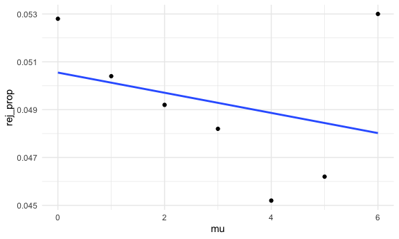

p8105_hw5_lg3239
================
Landi Guo
2022-11-13

## Problem 2

``` r
wp = read_csv("hw5_files/homicide-data.csv")
```

    ## Rows: 52179 Columns: 12
    ## ── Column specification ────────────────────────────────────────────────────────
    ## Delimiter: ","
    ## chr (9): uid, victim_last, victim_first, victim_race, victim_age, victim_sex...
    ## dbl (3): reported_date, lat, lon
    ## 
    ## ℹ Use `spec()` to retrieve the full column specification for this data.
    ## ℹ Specify the column types or set `show_col_types = FALSE` to quiet this message.

The raw data contains 12 columns and 52179 rows with each row
representing a homicide case. Variables include reported date,
demographic identifiers for the victim, location of killing, and whether
an arrest was made. The variables are uid, reported_date, victim_last,
victim_first, victim_race, victim_age, victim_sex, city, state, lat,
lon, disposition. These homicides happened in 50 cities in America. The
victim’s age ranges from 0 to Unknown.

`city_total` object contains the dataframe with columns `city_state` and
`total_h`, the number of total homicides happened in each city.
`city_unsolve`object contains the dataframe with columns `city_state`
and `unsolved_h`, the number of total unsolved homicides happened in
each city. Since the number of columns differs in these two dataframes,
I found the missing city using logical operations and added this missing
city with total of 0 in `city_unsolve`. Lastly, joining the two
dataframes into `city_prop`, using `full_join`.

``` r
city_total = 
  wp %>%
  mutate(city_state = str_c(city, ", ", state)) %>%
  group_by(city_state) %>%
  summarise(total_h = n()) %>%
  mutate(total_h = as.numeric(total_h))

city_unsolve = 
  wp %>%
  mutate(city_state = str_c(city, ", ", state)) %>%
  filter(disposition %in% c("Closed without arrest", "Open/No arrest")) %>%
  group_by(city_state) %>%
  summarise(unsolved_h = n()) 

missing_city = pull(city_total, city_state)[!pull(city_total, city_state) %in% pull(city_unsolve, city_state)]

city_unsolve = rbind(city_unsolve, c(missing_city, 0)) %>%
  mutate(unsolved_h = as.numeric(unsolved_h))

city_prop = full_join(city_unsolve, city_total)
```

    ## Joining, by = "city_state"

``` r
city_prop
```

    ## # A tibble: 51 × 3
    ##    city_state      unsolved_h total_h
    ##    <chr>                <dbl>   <dbl>
    ##  1 Albuquerque, NM        146     378
    ##  2 Atlanta, GA            373     973
    ##  3 Baltimore, MD         1825    2827
    ##  4 Baton Rouge, LA        196     424
    ##  5 Birmingham, AL         347     800
    ##  6 Boston, MA             310     614
    ##  7 Buffalo, NY            319     521
    ##  8 Charlotte, NC          206     687
    ##  9 Chicago, IL           4073    5535
    ## 10 Cincinnati, OH         309     694
    ## # … with 41 more rows

Conduct `prop.test` on Baltimore’s data.

``` r
baltimore_prop = prop.test(x = 1825, n = 2827)
baltimore_prop %>%
  broom::tidy() %>%
  select(estimate, conf.low, conf.high)
```

    ## # A tibble: 1 × 3
    ##   estimate conf.low conf.high
    ##      <dbl>    <dbl>     <dbl>
    ## 1    0.646    0.628     0.663

Conduct `prop.test` on each city in `city_prop`. Use `map2` on
`unsolved_h` and `total_h` to perform prop.test, resulting in list
columns `ptest`. Use `broom::tidy` on `ptest`. Select desired result
columns within `ptest` and `unnest` it. Remove unwanted columns.

``` r
city_test =
  city_prop %>%
  mutate(ptest = map2(.x = unsolved_h, .y = total_h, ~prop.test(x = .x, n = .y))) %>%
  mutate(ptest = map(ptest, broom::tidy)) %>%
  mutate(ptest = map(ptest, ~select(., estimate, conf.low, conf.high))) %>%
  unnest(ptest) %>%
  select(-unsolved_h, -total_h)
city_test
```

    ## # A tibble: 51 × 4
    ##    city_state      estimate conf.low conf.high
    ##    <chr>              <dbl>    <dbl>     <dbl>
    ##  1 Albuquerque, NM    0.386    0.337     0.438
    ##  2 Atlanta, GA        0.383    0.353     0.415
    ##  3 Baltimore, MD      0.646    0.628     0.663
    ##  4 Baton Rouge, LA    0.462    0.414     0.511
    ##  5 Birmingham, AL     0.434    0.399     0.469
    ##  6 Boston, MA         0.505    0.465     0.545
    ##  7 Buffalo, NY        0.612    0.569     0.654
    ##  8 Charlotte, NC      0.300    0.266     0.336
    ##  9 Chicago, IL        0.736    0.724     0.747
    ## 10 Cincinnati, OH     0.445    0.408     0.483
    ## # … with 41 more rows

This plot shows the estimated proportion of each city with its
confidence interval.

``` r
city_test %>%
  mutate(city_state = fct_reorder(city_state, estimate)) %>%
  ggplot(aes(x = city_state, y = estimate)) +
  geom_point(size = 0.7) +
  geom_errorbar(aes(ymin = conf.low, ymax = conf.high), width = 0.5) +
  theme(axis.text.x = element_text(angle = 90, hjust = 1)) +
  labs(
    x = "City, State",
    y = "Proportion of unsolved",
    title = "Estimated proportion of unsolved homicides for each city"
  )
```


## Problem 3

``` r
mu_p_model = function(mu, n = 30, sigma = 5) {
  outputlist = vector("list", length = 5000)
  for (i in 1:5000) {
    dist = rnorm(n = n, mean = mu, sd = sigma)
    result = 
      t.test(dist, mu = mu) %>% 
      broom::tidy() %>% 
      select(estimate, p.value)
    outputlist[[i]] = result
  }
  tibble(mu = mu, result = outputlist) %>%
    unnest(result)
}
```

``` r
df = mu_p_model(0)
for (i in 1:6) {
  df_temp = mu_p_model(i)
  df = bind_rows(df, df_temp)
}

reject_df = 
  df %>%
  filter(p.value < 0.05) %>%
  group_by(mu) %>%
  summarise(rej_prop = n()/5000,
            rej_mu_hat = mean(estimate))

result_df = 
  df %>%
  group_by(mu) %>%
  summarise(mu_hat = mean(estimate))

comb_df = full_join(reject_df, result_df)
```

    ## Joining, by = "mu"

``` r
comb_df
```

    ## # A tibble: 7 × 4
    ##      mu rej_prop rej_mu_hat  mu_hat
    ##   <dbl>    <dbl>      <dbl>   <dbl>
    ## 1     0   0.0528     0.0400 -0.0129
    ## 2     1   0.0504     0.940   0.989 
    ## 3     2   0.0492     2.25    2.02  
    ## 4     3   0.0482     2.85    2.98  
    ## 5     4   0.0452     3.95    3.97  
    ## 6     5   0.0462     4.87    4.99  
    ## 7     6   0.053      6.07    6.01

``` r
reject_df %>%
  ggplot(aes(x = mu, y = rej_prop)) +
  geom_point() +
  geom_smooth(method = 'lm', se = FALSE)
```

    ## `geom_smooth()` using formula 'y ~ x'



``` r
comb_df %>%
  ggplot(aes(x = mu)) +
  geom_point(aes(y = mu_hat, color = "blue")) +
  geom_point(aes(y = rej_mu_hat, color = 'red')) +
  scale_colour_manual(name = "estimate",
                     labels = c("mu_hat", "reject_mu_hat"),
                     values = c(blue = "blue", red = "red")) +
  labs(
    x = "μ",
    y = "estimate"
  )
```


