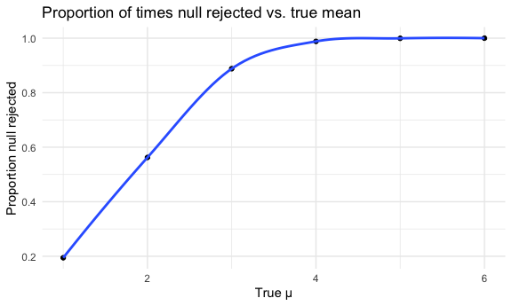

p8105_hw5_lg3239
================
Landi Guo
2022-11-13

## Problem 2

``` r
wp = read_csv("hw5_files/homicide-data.csv")
```

    ## Rows: 52179 Columns: 12
    ## ── Column specification ────────────────────────────────────────────────────────
    ## Delimiter: ","
    ## chr (9): uid, victim_last, victim_first, victim_race, victim_age, victim_sex...
    ## dbl (3): reported_date, lat, lon
    ## 
    ## ℹ Use `spec()` to retrieve the full column specification for this data.
    ## ℹ Specify the column types or set `show_col_types = FALSE` to quiet this message.

``` r
wp = wp %>%
  mutate(state = case_when(
    state == "AL" & city == "Tulsa" ~ "OK",
    TRUE ~ state))
```

The raw data contains 12 columns and 52179 rows with each row
representing a homicide case. Variables include reported date,
demographic identifiers for the victim, location of killing, and whether
an arrest was made. The variables are uid, reported_date, victim_last,
victim_first, victim_race, victim_age, victim_sex, city, state, lat,
lon, disposition. These homicides happened in 50 cities in America. The
victim’s age ranges from 0 to Unknown. The error with wrong state name
“AL” for city Tulsa is fixed by changing it to state “OK”.

`city_total` object contains the dataframe with columns `city_state` and
`total_h`, the number of total homicides happened in each city.
`city_unsolve`object contains the dataframe with columns `city_state`
and `unsolved_h`, the number of total unsolved homicides happened in
each city. Lastly, joining the two dataframes into `city_prop`, using
`full_join`.

``` r
city_total = 
  wp %>%
  mutate(city_state = str_c(city, ", ", state)) %>%
  group_by(city_state) %>%
  summarise(total_h = n()) %>%
  mutate(total_h = as.numeric(total_h))

city_unsolve = 
  wp %>%
  mutate(city_state = str_c(city, ", ", state)) %>%
  filter(disposition %in% c("Closed without arrest", "Open/No arrest")) %>%
  group_by(city_state) %>%
  summarise(unsolved_h = n()) 

city_prop = full_join(city_unsolve, city_total)
```

    ## Joining, by = "city_state"

Conduct `prop.test` on Baltimore’s data. The estimated proportion and
confidence interval are listed below.

``` r
baltimore_prop = prop.test(x = 1825, n = 2827)
baltimore_prop %>%
  broom::tidy() %>%
  select(estimate, conf.low, conf.high)
```

    ## # A tibble: 1 × 3
    ##   estimate conf.low conf.high
    ##      <dbl>    <dbl>     <dbl>
    ## 1    0.646    0.628     0.663

Conduct `prop.test` on each city in `city_prop`. Use `map2` on
`unsolved_h` and `total_h` to perform prop.test, resulting in list
columns `ptest`. Use `broom::tidy` on `ptest`. Select desired result
columns within `ptest` and `unnest` it. Remove unwanted columns.

``` r
city_test =
  city_prop %>%
  mutate(ptest = map2(.x = unsolved_h, .y = total_h, ~prop.test(x = .x, n = .y))) %>%
  mutate(ptest = map(ptest, broom::tidy)) %>%
  mutate(ptest = map(ptest, ~select(., estimate, conf.low, conf.high))) %>%
  unnest(ptest) %>%
  select(-unsolved_h, -total_h)
```

This plot shows the estimated proportion of each city with its
confidence interval. `fct_reorder` is used to reorder `city_state` based
on `estimate`. `geom_point` and `geom_errorbar` are used to create a
point plot with confidence intervals.

``` r
city_test %>%
  mutate(city_state = fct_reorder(city_state, estimate)) %>%
  ggplot(aes(x = city_state, y = estimate)) +
  geom_point(size = 0.5) +
  geom_errorbar(aes(ymin = conf.low, ymax = conf.high), width = 0.5) +
  theme(axis.text.x = element_text(angle = 90, hjust = 1)) +
  labs(
    x = "City, State",
    y = "Proportion of unsolved",
    title = "Estimated proportion of unsolved homicides for each city"
  )
```


## Problem 3

Create a `mu_p_model` function to record the estimated mean and p-value
from a t-test on normal distribution with fixed parameters n = 30, sigma
= 5.

``` r
mu_p_model = function(mu, n = 30, sigma = 5) {
  x = rnorm(mean = mu, n = n, sd = sigma)
  t = t.test(x, mu = 0) %>% broom::tidy()
  tibble(
    mu = mu,
    mu_hat = pull(t, estimate),
    p_val = pull(t, p.value)
  )
}


mu_0 = rerun(5000, mu_p_model(0)) %>% bind_rows()
```

Create an `output` list to store the result of each different mu value.
Use `rerun` to iterate 5000 times `mu_p_model` for each different mu
value. `bind_rows` and save the result in `df`.

``` r
output = vector("list", length = 6)
for (i in 1:6) {
  output[[i]] = rerun(5000, mu_p_model(i)) %>% bind_rows()
}
df = output %>% bind_rows()
```

`filter` results with p-value less than 0.05 and `group_by` each mu.
`summarise` the total number of rows within each mu then divided by 5000
to get the proportion of times the null was rejected. `summarise` the
mean of total mu_hat within each mu to get the average estimate when
null was rejected. These results are saved in `reject_df`.

For making the second plot, `group_by` each mu in `df`, then `summarise`
the average estimate of mu_hat. These results are saved in `result_df`.

Finally, combine these two data frames by `full_join`

``` r
reject_df = 
  df %>%
  filter(p_val < 0.05) %>%
  group_by(mu) %>%
  summarise(rej_prop = n()/5000,
            rej_mu_hat = mean(mu_hat))

result_df = 
  df %>%
  group_by(mu) %>%
  summarise(mu_hat = mean(mu_hat))

comb_df = full_join(reject_df, result_df)
```

    ## Joining, by = "mu"

``` r
head(comb_df)
```

    ## # A tibble: 6 × 4
    ##      mu rej_prop rej_mu_hat mu_hat
    ##   <int>    <dbl>      <dbl>  <dbl>
    ## 1     1    0.194       2.26   1.04
    ## 2     2    0.562       2.62   2.00
    ## 3     3    0.888       3.18   2.99
    ## 4     4    0.988       4.04   4.01
    ## 5     5    0.999       4.99   4.99
    ## 6     6    1           5.97   5.97

This plot shows the proportion of times the null (mu_0 = 0) was rejected
(the power of the test) vs. the true value of mu. The effect size is the
difference between the true mean and the mean 0, so the effect size
increases as the true mean go from 0 to 6. The probability of observing
a null mean of 0 at the true mean of 6 is low, so the probability of
rejecting the null is high. Therefore, as the effect size increases, the
power of the test increases.

``` r
reject_df %>%
  ggplot(aes(x = mu, y = rej_prop)) +
  geom_point() +
  geom_smooth(se = FALSE) +
  labs(
    x = "True μ",
    y = "Proportion null rejected",
    title = "Proportion of times null rejected vs. true mean"
  )
```

    ## `geom_smooth()` using method = 'loess' and formula 'y ~ x'



This plot shows the average estimate of mu vs. the true mu, and the
average estimate of mu when null was rejected vs. the true mu. When mu
is small, the power of the test is small, only the means that are far
from 0 will be considered reject. As mu increases, the power of the test
increases, almost all means are far from 0 and will be rejected,
therefore, the average mean across tests for which the null is rejected
approximately equal to the true mean.

``` r
comb_df %>%
  ggplot(aes(x = mu)) +
  geom_point(aes(y = mu_hat, color = "blue"), alpha = 0.7) +
  geom_point(aes(y = rej_mu_hat, color = 'red'), alpha = 0.7) +
  scale_colour_manual(name = "estimate",
                     labels = c("mu_hat", "reject_mu_hat"),
                     values = c(blue = "blue", red = "red")) +
  labs(
    x = "μ",
    y = "Average estimate"
  )
```


